# TODO: Write guide for adding stuff for designers.
Assume designers know nothing as a baseline. Tentative list of things that will need to be added:
- Adding content
	- Models
		- Figure out how bones work with the importing process.
	- Dialogue
		- The dialogue file format
		- Using the dialogue file generator (text ver. and UI ver.)
		- Creating one manually (last resort)
	- Audio
		- Filetype to use
		- How to import it
		- Which audio node to use for a specific purpose
			- I.e  AudioStreamPlayer and its 3D counterpart
			- i.e  how to play audio everywhere and how to play audio at a location
- Pushing changes to the github repository.


# Contents
0. [Terminology](#0-terminology)
1. [Creating Models](#1-creating-models)
	1. [Rename Things](#1-1-rename-things)
	2. [Keep Textures With Models](#1-2-keep-textures-with-models)
	3. [Scale](#1-3-scale)
2. [Importing Models into Godot](#2-importing-models-into-godot)
	1. [All-in-One or Separate Parts?](#2-1-all-in-one-or-separate-parts) 
	2. [Use `.blend` Files For Models](#2-2-use-blend-files-for-models)
	3. [Configuring Model Import Settings](#2-3-configuring-model-import-settings)
3. [Setting up the World](#3-setting-up-the-world)
	1. [Adding Collision to the Environment](#3-1-adding-collision-to-the-environment)
	2. [Other Visuals](#3-2-other-visuals)
	3. [Letting the Player Explore the Environment](#3-3-letting-the-player-explore-the-environment)
4. [Proper Node Setup](#4-proper-node-setup)
	1. [Generally](#4-1-generally)
	2. [Creating/Adding a Node](#4-2-creatingadding-a-node)
		1. [Root](#root)
		2. [Create Child](#create-child)
		3. [Instantiate Scene](#instantiate-scene)
	3. [Naming a Node](#4-3-naming-a-node)
	4. [Built-in Godot Nodes](#4-4-built-in-godot-nodes)
		- [StaticBody3D & CollisionShape3D](#staticbody3d--collisionshape3d)
	4. [Nodes Created by Us](#4-5-nodes-created-by-us)
		- [NOTE: Extending Functionality](#note-extending-functionality)
		- [ InputHandler](#inputhandler)
		- [Player](#player)
		- [PlayerCamera](#player-camera)
		- [ NPC](#npc)
		- [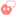 Interactable NPC](#interactable-npc)


# 0. Terminology
**Import**:  To drag-n-drop files into Godot ***or*** move files into the Godot project folder via your computer's file explorer.  Both methods are treated the same by Godot.

**Movie Clipboard Icon**:  In Godot, this symbol means the node has a saved `.tscn` file and is referencing it.  Click this icon to open this scene.

**Scene**:  In Godot, this is a collection of nodes.

**FileSystem**:  The Godot file explorer.  It is located in the left panel on the bottom left.

**MeshInstance3D**:  A Godot node that holds and displays mesh data.  Its icon is a red-ish square with a diagonal line through it.

**Node(basic)**:  A Godot node that all nodes inherit from.  Its icon is a white hollow circle.

# 1. Creating Models
When creating models for the game, whether it be for the environment or the [ Interactable NPCs](#interactable-npc), there a few things to keep in mind.

## 1-1. Rename Things
Rename any objects or materials you create in Blender.  It'll make things easier both in-engine and while modeling if things are named properly so you can easily reference them later.  There's no established naming scheme (e.g  Camel Case, Snake Case), so just name things so it's easy to tell what they are when reading them. 

## 1-2. Keep Textures With Models
It is recommend you keep texture files next to your model files, or keep them in the same relative path.
```
❌ Bad
--------------------------------
Desktop  
└── rusty-metal.png  
Documents  
└── test-environment.blend
--------------------------------

✅ Good
--------------------------------
models  
└── environment  
    ├── rusty-metal.png  
    └── test-environment.blend
--------------------------------

✅ Also Good
--------------------------------
models  
├── environment  
│   └── test-environment.blend  
└── textures  
    └── rusty-metal.png
--------------------------------
```
If you don't do this, while the texture may be able to load perfectly fine on your system, it may not when you share it with the rest of the team.  When sharing the file (either via GitHub or uploading via Discord), also share the texture files.

**NOTE:**  This may not be a problem if you export the model to a `glTF/glb` file, as Blender seems to pack the texture files with the model.  However, this can lead to duplicate texture files in the project, which unnececssarily increases filesize and will be annoying to fix later down the line.

## 1-3. Scale
When scaling your objects, make sure their scale doesn't go into the negatives, especially if the player is supposed to interact with them.  For whatever reason, if one or multiple of the axes are scaled negatively, the player will freeze in place and get softlocked.


# 2. Importing Models into Godot
Importing models into Godot is pretty easy as Godot automatically does the main stuff.  However, there arer a few things you should do so doing things with these models in Godot is easy.

## 2-1. All-In-One or Separate Parts?
There are two ways you could create a model.  One way is to keep all of your objects/shapes in one file (e.g  a player model).  Another is to create a separate file for each object/shape and import them into one "master" file (e.g  a common chair prop).  Both ways are valid, but if you choose to do the latter, do *not* assemble the parts in Godot if you plan on both adding collision and scaling them.  Refer to the "[Adding Collision](#adding-collision)" section for more details.  Additionally, keeping all modifications to a model to one place (i.e Blender) is better than having to keep track of what changes you've made at any possible point.
- e.g  you make a cube for your environment in Blender and make it 1 meter tall.  After checking on the cube in Godot, you are confused as to why it's now 0.75 meters tall.  It turns out you modified its scale in Godot and forgot about doing that.

### "How do I link an external model from a Blender file to a separate Blender file, while also telling the separate Blender file I made changes to the external model without having to re-import it?"
First, open the Blender file you want to import your external file into.  Next, drag and drop the Blender file with the external model into Blender.  You should get the following tooltip/pop-up.  Click the `Link` option.
<div align="center">
  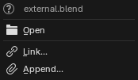
</div>

Next, enter the `Mesh` folder.  This holds all of the meshes in the Blender file you just drag and dropped.  Locate the external model you want to link and click the `Link` button in the bottom right corner of the file explorer pop-up window.
<div align="center">
  
</div>

Your external model is now in the separate Blender file.  You can move, rotate, and scale this model in this separate Blender file.  Updating the external model in its Blender file will be reflected in the separate Blender file.  *However*, it won't do this automatically.  There is an addon that adds this functionality (https://extensions.blender.org/add-ons/auto-reload/), but we haven't tested it.  Here's how to do it manually if the addon doesn't work:
1. Navigate to the Outliner/Object explorer in the top right and click the dropdown menu with the stacked images icon.  This is the `Display Mode` menu for the outliner.
<div align="center">
  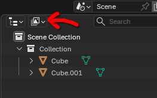
</div>

2. Open the dropdown menu and select `Blender File` (The normal display mode is `View Layer` by the way).  Next, locate an entry that contains the name of the Blender file with your external model and a link icon next to it.  This can either be found under the `Libraries` folder or at the bottom of the list.  Then right click the entry and select `Reload`.
<div align="center">
  
</div>

The changes you made to the model should now be visible.


#### "Why can't I use the object in the Object folder?"
You won't be able to move it for whatever reason.  Here's the official Blender documentation on it:  https://docs.blender.org/manual/en/latest/files/linked_libraries/link_append.html

#### "Why can't I just put the object into a collection and import the collection?"
While this will seem to work initally, when you get to generating the Occluder for the model in the "[Configuring the Model Import Settings](#2-3-configuring-model-import-settings)" section, the generated Occluder mesh for the model will be at the position the model is at in its source Blender file (usually 0,0,0).
<div align="center">
  
</div>

If you don't care about this model being occluded though, I suppose it's fine to do this?  Ideally everything would have an occlusion mesh though.


## 2-2. Use `.blend` Files For Models
You don't have to export Blender files into a different format, as Godot can auto-import them without too much issue.  Additionally, any edits you save to the imported `.blend` file will automatically be re-imported into Godot without you having to redo the entire import process.  (There are some things you'll have to "redo" again but it's mainly for new stuff you add.  We''ll get to that).

Upon opening a `.blend` file in Godot, you should see something like the following pop-up window.  **Things may take a bit to import depending on the size of the model.**  This is usually because the model you're importing has a lot of things to import (e.g  a lot of vertices).  Don't worry though, just let it sit for a minute or two and Godot should finish loading everything.
<div align="center">
  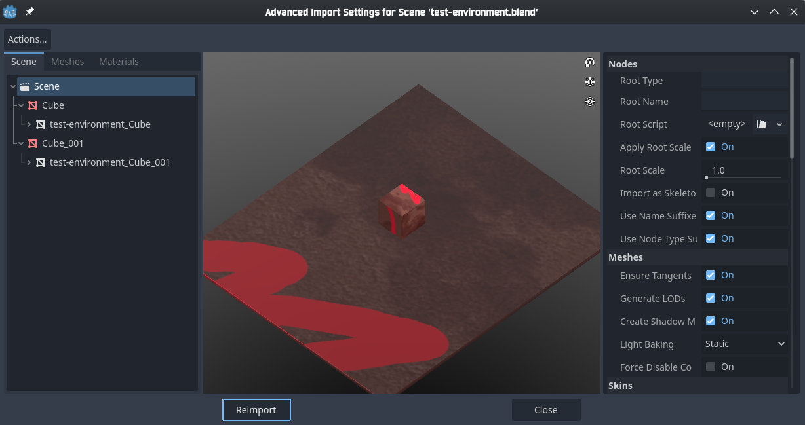
</div>

**NOTE:** You may need to tell Godot when Blender is installed if Godot can't automatically find where Blender is installed.  You'll know if you have to if you see either of the following after trying to open a `.blend` file in Godot.
<div align="center">
  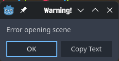
</div>

<div align="center">
  
</div>

You can tell Godot where Blender is by going to (from the top left) `Editor > Editor Settings > FileSystem > Import > Blender > Blender Path` and adding the path to your local Blender executable there, including the actual executable.  In the Editor Settings panel, you can also search for "Blender" to more quickly find the appropriate setting subsection.
<div align="center">
  
</div>

<div align="center">
  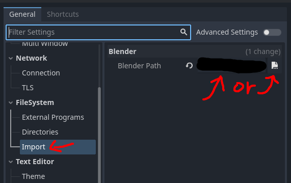
</div>

You can either paste the path into the text box or click the file icon next to the text field input and navigate to it from there.

### "My imported `.blend` models have no texture!"
This may be because you didn't also import the model's texture files along with the model.  This issue can be fixed by just moving the model's texture files to same relative location it expects them to be.  You do not have to re-import the model.

### "What if I have issues importing `.blend` files due to X?"
If there is an issue importing models using the `.blend` method:
1) Contact Ayden about the issue.  He should be able to assist with the process since he's been able to do this without issue for a couple of test models.  If you cannot get a hold of him, or you need to be able to import models *now*:
2) Export the model to a `glTF 2.0/glb` model.  This is the recommended file format for models you want to import into Godot.  (`.blend` is in second place due to theoretical workflows using older versions of Blender, and/or not all development-group workflows having everyone with Blender installed).  This will lead to duplicate texture files in the project, so keep that in mind if you decide not to fix your issue with `.blend` files not importing.

## 2-3. Configuring Model Import Settings
Your model is now in Godot!  Before you start using it though, there are some things we recommend you configure before continuing onward.

First, open the model file by double-clicking it in Godot.  This should bring up a pop-up that looks something like this:
<div align="center">
  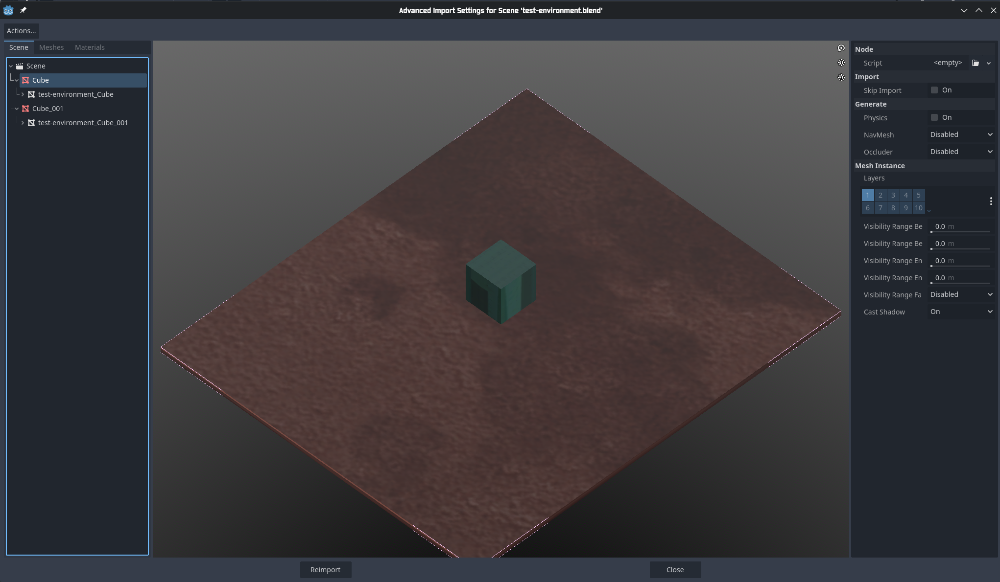
</div>

Now click on one of the `MeshInstance3D` nodes in the left panel.
<div align="center">
  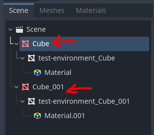
</div>

Go to the right panel, and under `Generate > Occluder`, set the value to `Mesh + Occluder`.  This will make it so the selected mesh won't render when it's not visible.
<div align="center">
  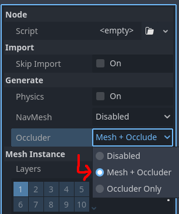
</div>

Now, we recommend doing this with each `MeshInstance3D` node.  You can't multi-select and change this property on multiple nodes at once, so you have to do it one at a time.  However, this isn't mandatory (yet) as we don't have any performance concerns at the moment.  However however, we will probably have to do this later down the line at some point, so better to do it now than later.

Once configuration is complete, click the `Reimport` button.  You'll have to repeat this process for any new meshes you add, but it'll only be for the new mesh instance.  If you modify an existing mesh, Godot will automatically recalculate the occlusion mesh.


# 3. Setting up the World.
While you can just add nodes to the scene willy-nilly after copy-pasting an already setup world, you should really learn how to setup one of these worlds from scratch to understand what parts are important.

An example world setup can be found in `_documentation/examples/environment-setup`.

## 3-1. Adding Collision to the Environment
Please refer to "[Importing Models into Godot](#2-importing-models-into-godot)" for importing the environment model into Godot.  This section is for setting up the collision for an environment.

First, drag the model file from the `FileSystem` tab into the main viewport.  This will place the model into the world.
<div align="center">
  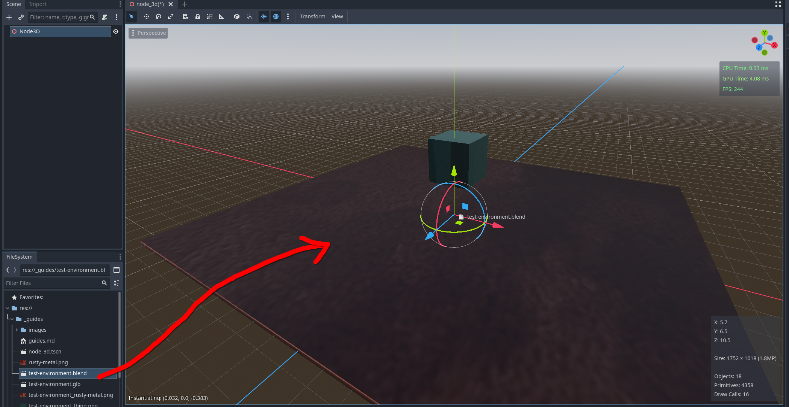
</div>

Next, click the Movie Clipboard Icon next to the eye to open the model in the editor.  When asked to confirm, click `New Inherited`.  Clicking `Open Anyway` won't let us save any changes we make to the model through Godot.
<div align="center">
  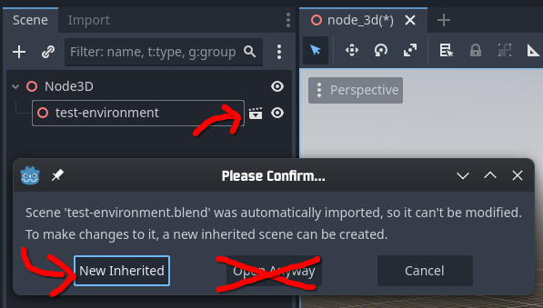
</div>

A new tab named `[unsaved](*)` should be opened with our model visible.  Any changes made to the model file will made reflected here.  You will not be able to modify any model objects in Godot.  This is ***NOT*** the scene where we put our player character or NPCs.  This is purely for the model of the world.  Be sure to save this new inherited scene into the `world` folder and name it something relevant.  For these screenshots going forward, it'll be named `test-environment_model`.
<div align="center">
  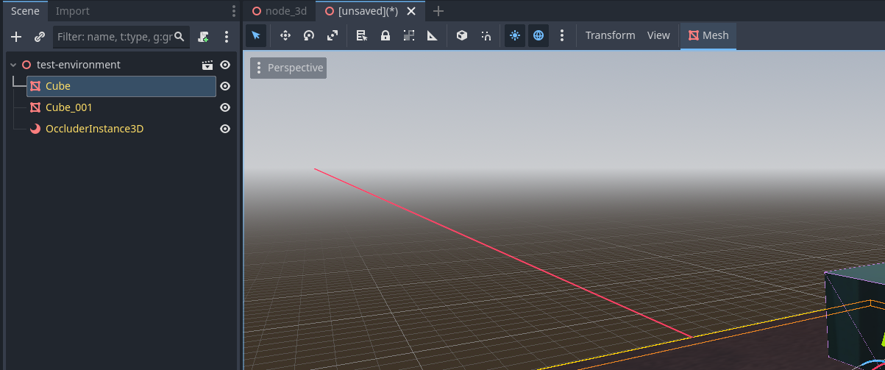
</div>

With our new inherited scene, we can now add collision.  Select the `MeshInstance3D` nodes you want to add collision to.  You can select multiple at once.  You don't have to do all of them at once; you can do chunks at a time.

Once all meshes are selected, navigate to the top toolbar, click the `Mesh` dropdown button with the `MeshInstance3D` icon, then click `Create Collision Shape...`
<div align="center">
  
</div>

You'll be presented with two options: one for how to create the collision nodes, and one for how the shape should be generated.  Set `Colllision Shape Placement` to `Static Body Child` and set `Collision Shape Type` to `Trimesh`.  There are hover tooltips for each option that describe what they do.
<div align="center">
  
</div>

Now, select each `StaticBody3D` that was generated.  You can select multiple at a time.  Then, go to the panel on the right and expand the `Collision` section.  Under `Layer`, enable Bit 2/Square 2/Environment and disable the rest of the bits/squares.  This tells Godot that anything that is supposed to collide with the environment is also supposed to collide with this.  Under `Mask`, disable all bits/squares.  This tells Godot that this `StaticBody3D` is not on the lookout for anything that is colliding with it.
<div align="center">
  
</div>

Remember to save your changes.

With collision setup, go back to your main world scene.  Select and delete the model you drag and dropped into the world, as this is not the new inherited scene we just finished creating.
<div align="center">
  
</div>

Now drag and drop the scene we setup the collision in onto the main viewport.  For these screenshots, it's `test-environment_model.tscn`.
<div align="center">
  
</div>

Also make sure its position is set to the origin of the scene (`0, 0, 0`).  Nothing will break if you don't do this, but it's nice to have the origin of the model be in the same place as the origin of the scene.
<div align="center">
  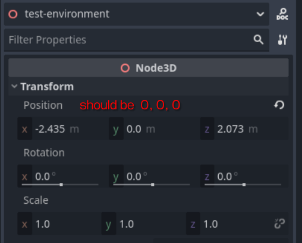
</div>

Your environment model with collisions should now be in the world!  Any changes you save to the environment model file should automatically be reflected in Godot when you make Godot focused (i.e click the Godot window).

### "Do I have to go through the whole collision generating process again whenever I update the model?"
No and yes.  If you only make a change to a single object's mesh, you won't have to generate collisions for the other objects you didn't modify.  However, for each object mesh you modifed, you will have to regenerate their collision.

You ***do not*** have to make a new inherited scene.  You'll just need to regenerate the collision shapes.


## 3-2. Other Visuals
Currently, there is only one other node needed to make the environment not look blank.  The view we get in the main viewport is not the world we see once we hit play.
<div align="center">
  
</div>
<div align="center">
  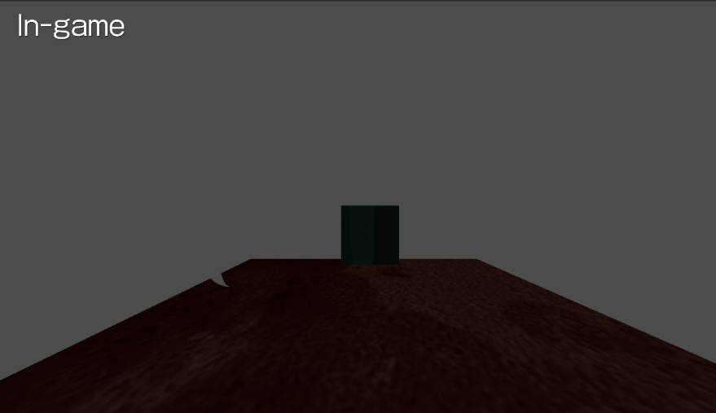
</div>

To fix this, add a `WorldEnvironment` node.  When you do, the main viewport's background will turn gray like it is in-game.  This doesn't look good though, so load the default environment resource (`default_environment.tres`) into the Environment property of the `WorldEnvironment` node by selecting the `WorldEnvironment` node, locating `default_environment.tres` in the `FileSystem`, and dragging and dropping it.
<div align="center">
  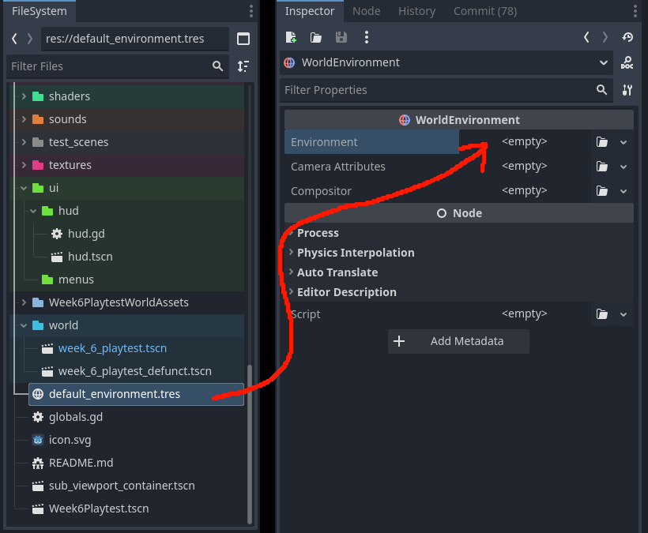
</div>

The world should look not-gray now.  As of writing, the world should look the same as it did during the Week 6 playtest.  I'm not too sure what each property of the environment resource does, so play around with them!  You can always reset them to their default value by clicking the reset/redo icon next to the property.


## 3-3. Letting the Player Explore the Environment.
To let the player actually explore this environment, there are two scenes you need to add:

1. `player.tscn`:  Located in `entites > player`
	- The initial position you put this player scene will be the position the player is at when this environment scene is loaded.
2. `player_camera.tscn`:  Located in `entities > player`
	- Unlike `player.tscn`, you don't have to move this anywhere.

Remember to read the "[Proper Node Setup](#4-proper-node-setup)" section to properly setup these nodes.

That's it!  Players will be able to explore this environment when the scene is loaded.  To test it out, press the `Run Current Scene` button in the top right, or press `F6`.
<div align="center">
  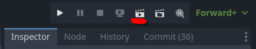
</div>

# 4. Proper Node Setup
This contains the proper node setup for each node, as well as any other general notes for other built-in Godot nodes.

## 4-1. Generally
Built-in Godot nodes and some nodes created by us may have a ⚠️ warning sign appear next to them.  This is because some property of the node isn't configured properly.  If you hover over the ⚠️ warning sign, a tooltip should appear explaining what needs to be done to make them go away.  For some warnings, you'll need to save the scene before it detects your changes.  Also, some improperly configured aspects won't warn you when they're not set.  For built-in Godot nodes, this is (usually) because there's no way for the node to detect it.  For nodes created by us, it may be due to an oversight or not *technically* being needed.

## 4-2. Creating/Adding a Node
There are three methods for creating/adding one of our custom nodes to a scene.  It is important you choose the right method as some nodes have needed children, which won't be added if you choose the wrong method.  The correct method to do so for each node will be noted in that node's subsection in the "[Nodes Created By Us](#4-5-nodes-created-by-us)" section.

### Root
This method is for when you're making one of our nodes the root node of a scene.  You'll want to do this if you're using one of our nodes as a base and customizing it (e.g  making a new NPC).

First, create an empty scene by clicking the `+` button located around the top of the middle area under the view switching area.
<div align="center">
  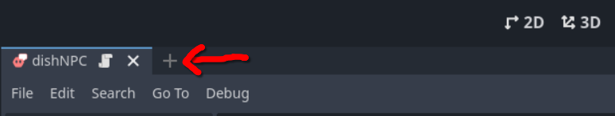
</div>

This should create a new tab named `[empty]`.  Next, in the left panel, click the `Other Node` button.  This will create a pop-up window that lists all of the built-in Godot nodes along with our custom nodes.
<div align="center">
  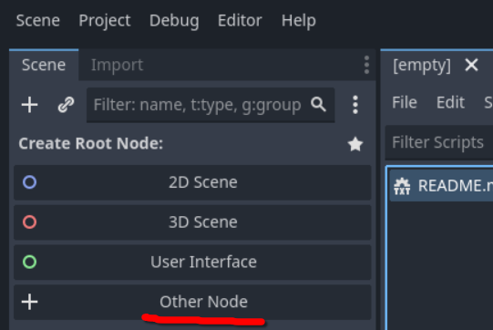
</div>
<div align="center">
  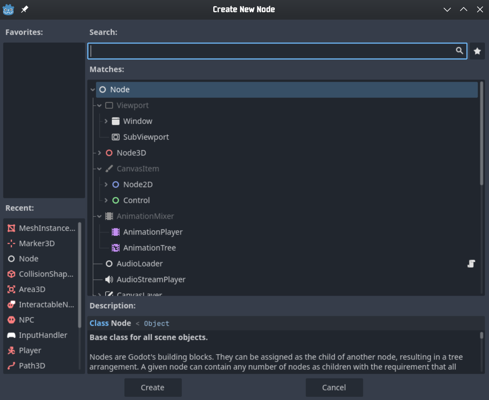
</div>

You can search for a node by clicking the search area, then typing.  The search area should be auto-selected when the pop-up window appears.  Once you find your node, click the `Create` button, double click the node, or press the `Enter` key.

### Create Child
This method is mainly used for nodes that don't have pre-configured children nodes.  Nodes that use this adding method can also be added with the [Instantiate Scene](#instantiate-scene) method.  This method is also how you add built-in Godot nodes.

Under the scene tab on the left panel, click the `+` button or right-click the node layout area and choose `Add Child Node...`.  This will create a pop-up window that lists all of the built-in Godot nodes along with our custom nodes.
<div align="center">
  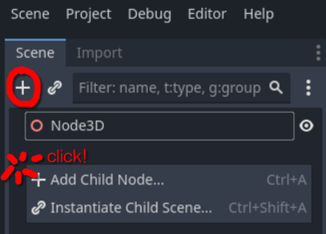
</div>
<div align="center">
  
</div>

You can search for a node by clicking the search area, then typing.  The search area should be auto-selected when the pop-up window appears.  Once you find your node, click the `Create` button, double click the node, or press the `Enter` key.

### Instantiate Scene
This method is mainly used when a node has pre-configured nodes setup in its scene file.  You can also use this method to add nodes that use the [Create Child](#create-child) method.

In the FileSystem, you can either search through the folders for the Scene you want to add, or you can search for them using the `Filter Files` search box.  Scenes are denoted by the `.tscn` extension.  Once you find your node/scene, drag and drop it onto a node in the `Scene` tab.
<div align="center">
  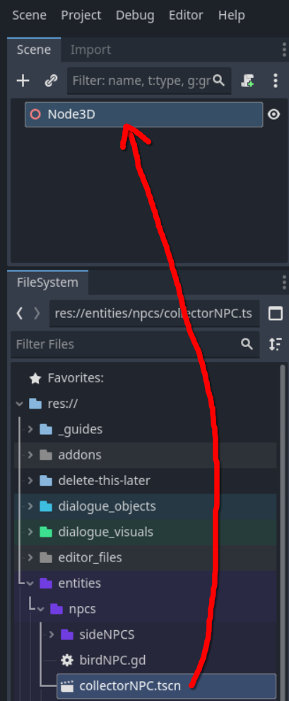
</div>

Alternatively, you can right-click the node layout area and choose `Instantiate Child Scene...`.  This will create a pop-up window that lists all `.tscn` files in the project.
<div align="center">
  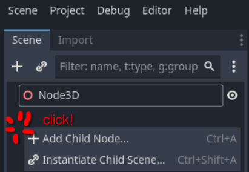
</div>
<div align="center">
  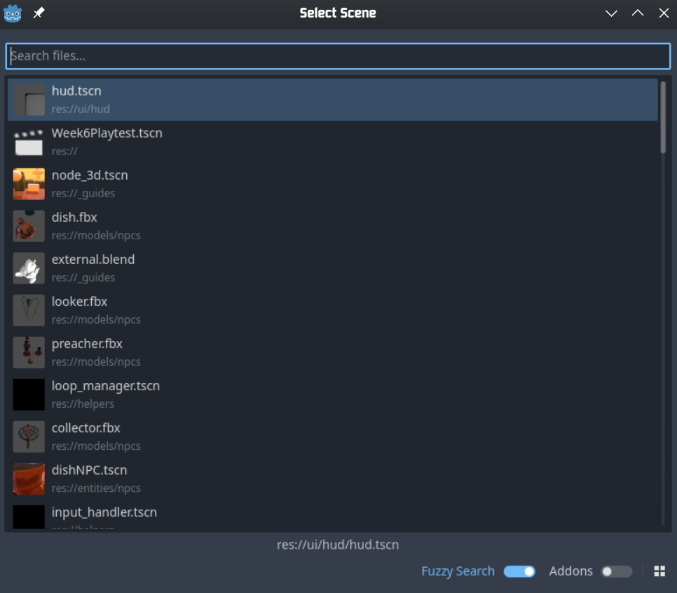
</div>


## 4-3. Naming a Node
Like with [Blender object names](#1-1-rename-things), you should give any node you add to a scene a proper name.  Sometimes, this isn't needed as the generic name is descriptive enough (e.g  a `CollisionShape3D` for an `Area3D`).  Other times, you should rename it to better convey its purpose (e.g  renaming an `Area3D` to "Hitbox" to convey that it is a hitbox).  Leaving everything with their default names won't break anything, but it'll make debugging take a bit longer.

## 4-4. Built-in Godot Nodes
### Area3D/StaticBody3D & CollisionShape3D
`StaticBody3D` is the main node type of a non-moving "solid" object and is usually used for the environment.  `Area3D` is the main node type for creating areas that will interact with each other for other, non-collision reasons (e.g  an interaction hitbox).  `CollisionShape3D` is a general-purpose collision node that handles the shape of collision-related nodes.

Scaling a `StaticBody3D` or `CollisionShape3D` un-uniformly (i.e not the same amount for each axis) will cause a ⚠️ warning sign to appear.  This is because scaling either of them this way can make collision go wonky.  Based on sparse testing, scaling the parent node should be fine.

To modify the size of a collision shape properly, modify the properties of the `CollisionShape3D`'s shape.
<div align="center">
  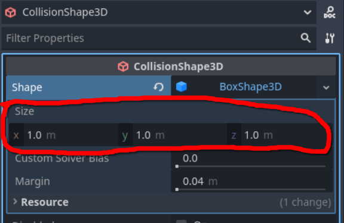
</div>

## 4-5. Nodes Created By Us
### NOTE: Extending Functionality
If you want to create additional code for one of our custom nodes (e.g  changing its rotation every frame), you'll want to extend its script.  To do this, first select the node you want to extend its script from.  Then, click the button that looks llike a scroll with an arrow on it.  This will create a pop-up window for attaching a script to this node.
<div align="center">
  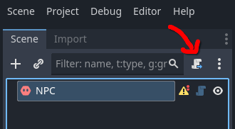
</div>
<div align="center">
  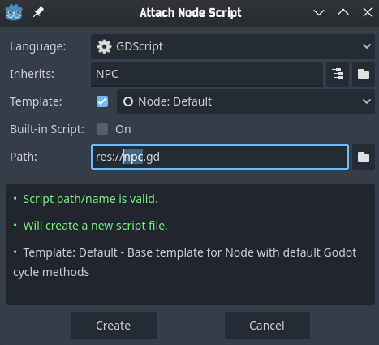
</div>

Next, make sure to set a proper name and save location for the script you're about to create.  For example, if you're creating a new [ NPC](#npc), save the script to `entities/npcs/` and name it the same name as your  NPC.  **Make sure you don't overwrite any existing files you don't want to overwrite**.  We'll be able to revert files that are backed up on the GitHub repository, but most likely won't be able to for other files.

###  InputHandler 
- **Corresponding scene file**: `helpers/input_handler.tscn`
- **Adding Method**:  [Create Child](#create-child)

Handles all potential inputs a player can make.  Should only be used if you need to know when a certain player input happens.  Otherwise, they will automatically setup by us when needed (e.g  [Player](#player) already comes with one).

To properly use an InputHandler, select it then go to the right panel.  Select the `Node` tab and enter the `Signals` tab if it isn't already selected.  You should now see `InputHandler`'s signals.

There are 4 signals the InputHandler emits:
1. `interact_button_pressed()`:
	- Emits when the interact button is pressed.
2. `jump_pressed()`:
	- Emits when the jump button is pressed.
3. `mouse_moved(distanceMoved: Vector2)`:
	- Emits when the mouse is moved.
	- `distanceMoved` is a `Vector2` that contains the `x` and `y` distance the mouse moved in this frame.
4. `update_input_direction(newDirection: Vector2)`:
	- Emits constantly to update the input direct the player is holding.
	- `newDirection` is a `Vector2` that contains a normalized version of the player's currently held input direction for this frame
		- e.g  holding right = `(1.0, 0.0)`
		- e.g  holding up = `(0.0, -1.0)`
		- e.g  holding up and right = `(sqrt(2), -sqrt(2))`

To connect a signal, select it and click the `Connect` button at the bottom of the panel.  This will open a node selection pop-up.  Now, pick the node you want to connect the signal to and click the `Connect` button.  This will automatically create a new function in your target node's script.

If you already have a function prepared, select the `Pick` button after selecting your target node.  This will open a new pop-up with all of the eligible functions in your target node's script.  If you don't see your function, make sure the types of its parameters are the same as the signal's.

### Player
- **Corresponding scene file**: `entities/player/player.tscn`
- **Adding Method**:  [Instantiate Scene](#instantiate-scene)

The main node that gets controlled by the player.  It currently needs no additional setup.  You can also mess around with its movement parameters if you'd like.

### Player Camera
- **Corresponding scene file**: `entities/player/player_camera.tscn`
- **Adding Method**:  [Instantiate Scene](#instantiate-scene)

Holds both the player's camera and the HUD node.  It has one required property: `Focus`.  `Focus` should be set to the main object that the player should see a first-person perspective from (e.g  [Player](#player)).

Might be switched to a Camera3D node if time allows for us to relook at the camera setup.

TODO:  verify this is still valid with the fixed camera bug.

###  NPC
- **Corresponding scene file**:  `None`
- **Adding Method**:  [Root](#root) if creating a new NPC, [Instantiate Scene](#instantiate-scene) if adding a pre-made NPC.

Requirements:
1. A model.
	- Please see section "[Importing Models into Godot](#2-importing-models-into-godot)" for how to properly import models into Godot.
	- Not used for anything currently, but may be used in nodes, classes, or scripts that extend this type of node (e.g  [ Interactable NPC](#interactable-npc))
2. A name.
	- This is different from naming this node in the current scene, as you can theorhetically have multiple copies in the same scene.  Currently, this parameter isn't for anything, but it may be used in nodes, classes, or scripts that extend this type of node (e.g  [ Interactable NPC](#interactable-npc))

A basic NPC that just exists in the world.  Currently, it doesn't do much.

TODO:  explain idle path navigation when that gets implemented.

###  Interactable NPC
- **Corresponding scene file**:  `None`
- **Adding Method**:  [Root](#root) if creating a new Interactable NPC, [Instantiate Scene](#instantiate-scene) if adding a pre-made NPC.
- **Inherits**:  [ NPC](#npc)
- **Example Setup**: `_documentation/examples/npc-setup`

An NPC that can be interacted with to begin a conversation.  If you do not plan on giving a NPC a dialogue interaction, please create an NPC instead.  All notes and aspects that apply to [ NPC](#npc) also apply to [ Interactable NPC](#interactable-npc).

Requirements:
1. Everything from [ NPC](#npc).
2. A hitbox.
	- A hitbox is an `Area3D` node with a `CollisionShape3D` child node.  The `CollisionShape3D` node controls the shape and the `Area3D` controls the configurations.
	- Make sure the `Area3D`'s collision layers are setup correctly.  You can configure these layers under the `Collision` tab on the right.  For [ Interactable NPCs](#interactable-npc), they require the 3rd bit of the `Layer` aspect to be set, and only that bit.  All bits under `Mask` shouldn't be set, but nothing will break if you forget to change them.
	- 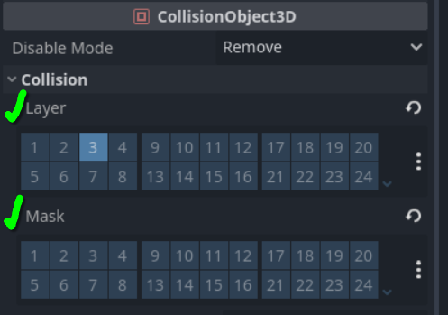
3. A dialogue box anchor.
	- This anchor is a `Marker3D` node and controls where the Dialogue Box spawns when a dialogue event happens.
	- There are two ways you can add this:
		1. As a child of this or a different node.  Doing it this way will make the Dialogue Box follow and rotate with the its parent.
		- 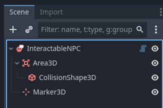

		2. As a child of a Node(basic).  This will make the Dialogue Box not move or rotate with any node.
		- 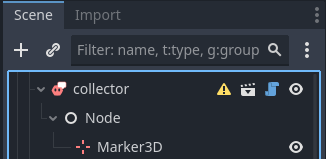

	- **Important:** If you choose option 2, the anchor's position will be relative to world space instead of local space.  What this means in practice is that it's position will be based around the origin of the environment instead of whichever parent node.
	- 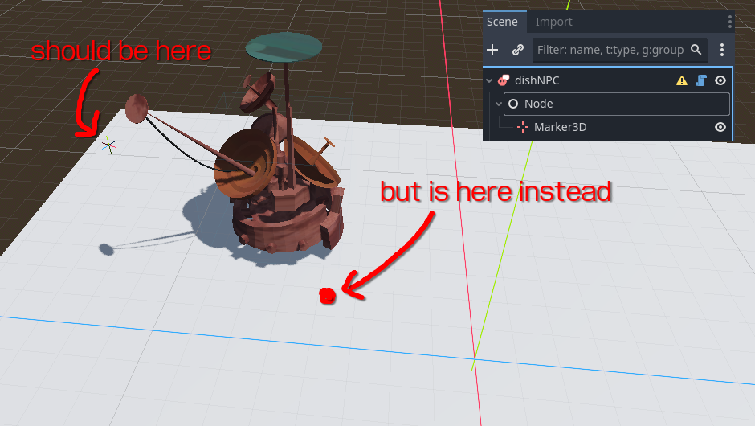
	- 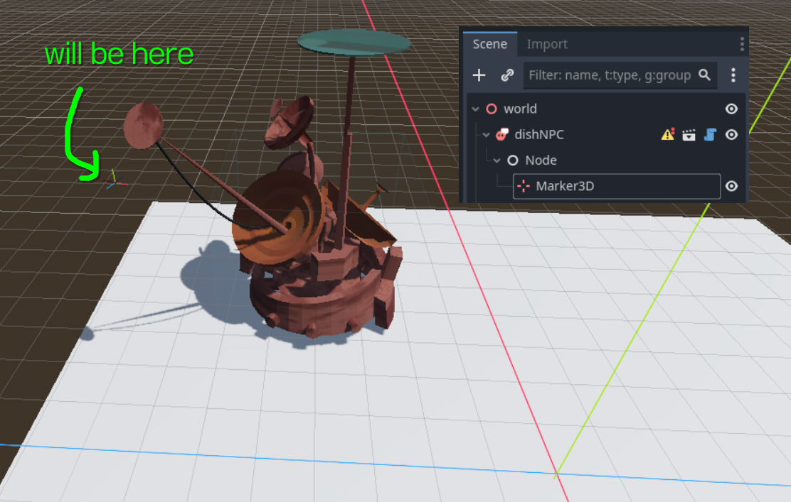
4. Initial dialogue ID
	- The initial dialogue object the dialogue event will use when the player interacts with this.
	- Valid dialogue objects are located in `dialogue_objects/[NPC name]/`.
