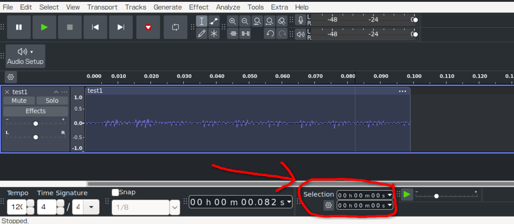
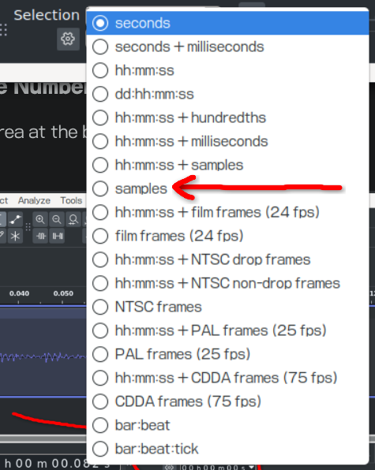
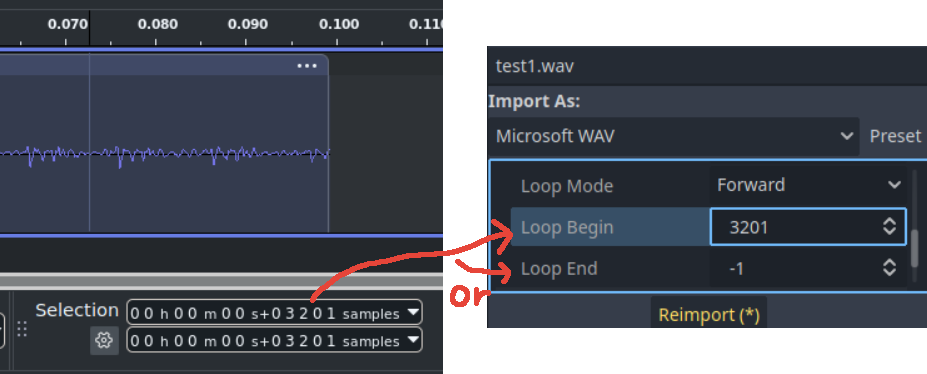

# Audio
Other additional information for audio in Godot can be found [in the online documentation](https://docs.godotengine.org/en/4.5/tutorials/assets_pipeline/importing_audio_samples.html).  It'd be good to go over the "Best Practices" section of this documentation.

There are also [audio buses](https://docs.godotengine.org/en/4.5/tutorials/audio/audio_buses.html#doc-audio-buses), which might be worth looking at as they can apply effects in-engine (e.g  echo, low-pass and high-pass filters).

## Index
- [File Types](#file-types)
	- [NOTE: Sample Number](#note-determining-sample-number-audacity)
- [AudioStreamPlayers](#audiostreamplayers)
- [Audio Streams](#audio-streams)

## File Types
When importing audio, there are two main file types to consider for our purposes.

| Type | Notes |
| ---- | ----- |
| `.wav` | Should be used for SFX or if you're utilizing our [AudioLoader](../framework_guides/helpers/audio_loader.md).  Also comes with compression options. |
| `.mp3` | Should be used for music or constantly playing audio. |

Both types come with the ability to loop them, but are slightly different.  `.wav` has multiple looping modes (none, forward, ping-pong, backward), while `.mp3` only has two (disabled and enabled).  `.wav` lets you define the loop start and end point, while `.mp3` only lets you define the loop start.  `.wav` defines these points by the number of samples after the start, `.mp3` does it in seconds.

### NOTE: Determining Sample Number (Audacity)
In Audacity, go to the Selection area at the bottom of the window and click the dropdown arrow/triangle.

  

Then select `samples`.

  

`hh:mm:ss + samples` doesn't give the raw sample count and requires you to do math.

The number in this area is the number you put into the loop start/end area.

  

## AudioStreamPlayers
There are three types of `AudioStreamPlayer`:

| Name | Description |
| ---- | ----------- |
| [`AudioStreamPlayer`](https://docs.godotengine.org/en/4.5/classes/class_audiostreamplayer.html) (white)  | Plays audio files. |
| [`AudioStreamPlayer2D`](https://docs.godotengine.org/en/4.5/classes/class_audiostreamplayer2d.html) (blue) | Plays audio files, pans audio depending on its position in 2D space. |
| [`AudioStreamPlayer3D`](https://docs.godotengine.org/en/4.5/classes/class_audiostreamplayer3d.html) (red)  | Plays audio files, pans audio depending on its position in 3D space. |

If you want position-based audio, use the 2D/blue version if it's playing on the "UI" and the 3D/red version if it's in the world,

If you just want to play an audio file as-is, use the white version.

All `AudioStreamPlayer`s come with a `finished` [signal](../terminology.md#signal), which is emitted when the audio loaded into its audio stream finishes playing.  If the audio is set to loop, this signal won't ever be emitted.

## Audio Streams
Aside from stream that are used to handle audio file types (WAV, MP3, OggVorbis) and ones that aren't important for this game (Microphone, Generator), here are some audio streams that might be interesting:

| Stream | Playback | Description |
| ------ | -------- | ----------- |
| [Randomizer](https://docs.godotengine.org/en/4.5/classes/class_audiostreamrandomizer.html#class-audiostreamrandomizer) | [Normal](https://docs.godotengine.org/en/4.5/classes/class_audiostreamplayback.html#class-audiostreamplayback) | Plays a randomly picked an audio stream from a list each time it's played.  Is used in our [AudioLoader](../framework_guides/helpers/audio_loader.md) system. |
| [Playlist](https://docs.godotengine.org/en/4.5/classes/class_audiostreamplaylist.html) | [Normal](https://docs.godotengine.org/en/4.5/classes/class_audiostreamplayback.html#class-audiostreamplayback) | Plays audio streams from a list continously like a playlist. |
| [Interactive](https://docs.godotengine.org/en/4.5/classes/class_audiostreaminteractive.html) | [Interactive](https://docs.godotengine.org/en/4.5/classes/class_audiostreamplaybackinteractive.html#class-audiostreamplaybackinteractive) | Allows you to play one audio stream and have transition rules when trying to play a different audio stream. |
| [Synchronized](https://docs.godotengine.org/en/4.5/classes/class_audiostreamsynchronized.html) | [Synchonized](https://docs.godotengine.org/en/4.5/classes/class_audiostreamplaybacksynchronized.html#class-audiostreamplaybacksynchronized), but there's no documentation, so [Normal](https://docs.godotengine.org/en/4.5/classes/class_audiostreamplayback.html#class-audiostreamplayback) | Plays multiple audio streams at the same time. |

The "playback" for an audio stream is created whenever an `AudioStreamPlayer` starts playing audio.  It can be retrieved by running `get_stream_playback()` on the `AudioStreamPlayer`.  The resulting playback will be empty if the `AudioStreamPlayer` isn't playing anything.

For the Interactive audio stream, you can switch which clip is playing by running `switch_to_clip()` or `switch_to_clip_by_name()` on the `AudioStreamPlayer`'s playback.

