# TODO: Write guide for adding stuff for designers.
Assume designers know nothing as a baseline. Tentative list of things that will need to be added:
- Renaming nodes to what their purpose is.
- Importing models.
- Adding collision to mesh parts.
- Paying attention to the little warning signs and how to fix them.
	- CollisionShape3D being scaled.
- How to resize collision shapes properly.
- How to properly create an interactible NPC.
	- Example interactible NPC setup.
- Creating a dialogue file.
	- By creating the file manually.
	- By using the tool. (text ver.)
	- By using the tool. (ui ver. once it exists)
- Which audio file type to use.
- Adding audio that plays everywhere.
- Example world scene setup.
	- Placing a player.
	- Placing a player camera.
	- The InputHandler.
- Pushing changes to the github repository.


Guides: (assume designers know nothing as a baseline)
- Naming things properly
	- Model file objects
	- Nodes in Godot
- Warnings and how to avoid them
	- I.e  the little cation sign that appears next to nodes
	- E.g  CollisionShape3D being scaled 
- Adding content
	- Dialogue
		- The dialogue file format
		- Using the dialogue file generator (text ver. and UI ver.)
	- Importing models
	- Importing environment models and adding collision to it
	- Importing audio
		- Audio filetype to use
	- Which audio node to use for a specific purpose
		- I.e  AudioStreamPlayer and its 3D counterpart
- Creating an NPC
- Example scenes
	- World
		- Placing player
		- Placing player camera
		- InputHandler
	- NPCs
- Pushing content to the GitHub repository

# 0. Terminology
**Import**:  To drag-n-drop files into Godot ***or*** move files into the Godot project folder directly.  Both methods are treated the same by Godot.

**MeshInstance3D**:  A Godot node that holds and displays mesh data.  Its icon is a red-ish square with a diagonal line through it.

# 1. Creating Models
When creating models for the game, whether it be for the environment or the interactable NPCs, there a few things to keep in mind.

## 1-1. Rename Things
Rename any objects or materials you create in Blender.  It'll make things easier both in-engine and while modeling if things are named properly so you can easily reference them later.  There's no established naming scheme (e.g  Camel Case, Snake Case), so just name things so it's easy to tell what they are when reading them. 

## 1-2. Keep Textures With Models
It is recommend you keep texture files next to your model files, or keep them in the same relative path.
```
❌ Bad
--------------------------------
Desktop  
└── rusty-metal.png  
Documents  
└── test-environment.blend
--------------------------------

✅ Good
--------------------------------
models  
└── environment  
    ├── rusty-metal.png  
    └── test-environment.blend
--------------------------------

✅ Also Good
--------------------------------
models  
├── environment  
│   └── test-environment.blend  
└── textures  
    └── rusty-metal.png
--------------------------------
```
If you don't do this, while the texture may be able to load perfectly fine on your system, it may not when you share it with the rest of the team.  When sharing the file (either via GitHub or uploading via Discord), also share the texture files.

**NOTE:**  This may not be a problem if you export the model to a `glTF/glb` file, as Blender seems to pack the texture files with the model.  However, this can lead to duplicate texture files in the project, which unnececssarily increases filesize and will be annoying to fix later down the line.

## 1-3. Scale
When scaling your objects, make sure their scale doesn't go into the negatives, especially if the player is supposed to interact with them.  For whatever reason, if one or multiple of the axes are scaled negatively, the player will freeze in place and get softlocked.

# 2. Importing Models into Godot
Importing models into Godot is pretty easy as Godot automatically does the main stuff.  However, there arer a few things you should do so doing things with these models in Godot is easy.

## 2-1. All-In-One or Separate Parts?
There are two ways you could create a model.  One way is to keep all of your objects/shapes in one file (e.g  a player model).  Another is to create a separate file for each object/shape and import them into one "master" file (e.g  a common chair prop).  Both ways are valid, but if you choose to do the latter, do *not* assemble the parts in Godot if you plan on both adding collision and scaling them.  Refer to the "[Adding Collision](#adding-collision)" section for more details.  Additionally, keeping all modifications to a model to one place (i.e Blender) is better than having to keep track of what changes you've made at any possible point.
- e.g  you make a cube for your environment in Blender and make it 1 meter tall.  After checking on the cube in Godot, you are confused as to why it's now 0.75 meters tall.  It turns out you modified its scale in Godot and forgot about doing that.

### "How do I link an external model from a Blender file to a separate Blender file, while also telling the separate Blender file I made changes to the external model without having to re-import it?"
First, open the Blender file you want to import your external file into.  Next, drag and drop the Blender file with the external model into Blender.  You should get the following tooltip/pop-up.  Click the `Link` option.
<div align="center">
  
</div>

Next, enter the `Mesh` folder.  This holds all of the meshes in the Blender file you just drag and dropped.  Locate the external model you want to link and click the `Link` button in the bottom right corner of the file explorer pop-up window.
<div align="center">
  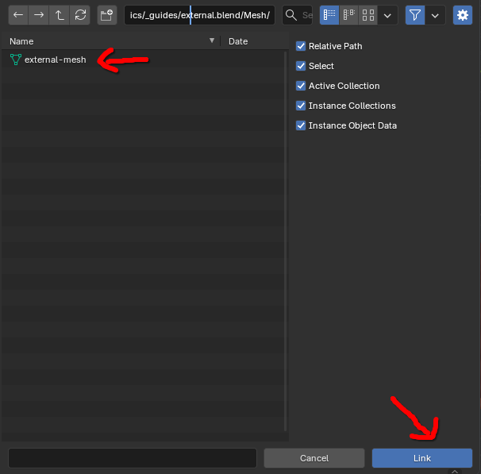
</div>

Your external model is now in the separate Blender file.  You can do whatever you want to do with it in this separate Blender file.  Updating the external model in its Blender file will be reflected in the separate Blender file.  *However*, it won't do this automatically.  There is an addon that adds this functionality (https://extensions.blender.org/add-ons/auto-reload/), but we haven't tested it.  Here's how to do it manually if the addon doesn't work:
1. Navigate to the Outliner/Object explorer in the top right and click the dropdown menu with the stacked images icon.  This is the `Display Mode` menu for the outliner.
<div align="center">
  
</div>

2. Open the dropdown menu and select `Blender File` (The normal display mode is `View Layer` by the way).  Next, locate an entry that contains the name of the Blender file with your external model and a link icon next to it.  This can either be found under the `Libraries` folder or at the bottom of the list.  Then right click the entry and select `Reload`.
<div align="center">
  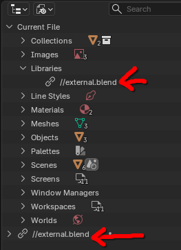
</div>

The changes you made to the model should now be visible.


#### "Why can't I use the object in the Object folder?"
You won't be able to move it for whatever reason.  Here's the official Blender documentation on it:  https://docs.blender.org/manual/en/latest/files/linked_libraries/link_append.html

#### "Why can't I just put the object into a collection and import the collection?"
While this will seem to work initally, when you get to generating the Occluder for the model in the "[Configuring the Model Import Settings](#2-3-configuring-the-model-import-settings)" section, the generated Occluder mesh for the model will be at the position the model is at in its source Blender file (usually 0,0,0).
<div align="center">
  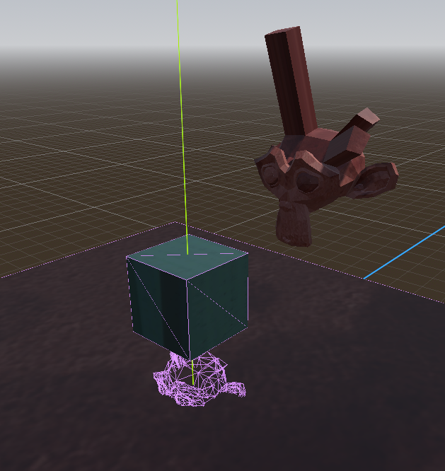
</div>

If you don't care about this model being occluded though, I suppose it's fine to do this?  Ideally everything would have an occlusion mesh though.


## 2-2. Import `.blend` Files Over Other File Types
You don't have to export Blender files into a different format, as Godot can auto-import them without too much issue.  Additionally, any edits you save to the imported `.blend` file will automatically be re-imported into Godot without you having to redo the entire import process.  (There are some things you'll have to "redo" again but it's mainly for new stuff you add.  We''ll get to that).

Upon opening a `.blend` file in Godot, you should see something like the following pop-up window.  **Things may take a bit to import depending on the size of the model.**  Don't worry though, just let it sit for a minute or two and Godot should finish loading everything. 
<div align="center">
  
</div>

**NOTE:** You may need to tell Godot when Blender is installed if Godot can't automatically find where Blender is installed.  You'll know if you have to if you see either of the following after trying to open a `.blend` file in Godot.
<div align="center">
  
</div>

<div align="center">
  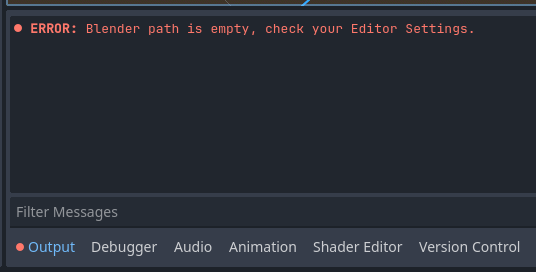
</div>

You can tell Godot where Blender is by going to (from the top left) `Editor > Editor Settings > FileSystem > Import > Blender > Blender Path` and adding the path to your local Blender executable there, including the actual executable.  In the Editor Settings panel, you can also search for "Blender" to more quickly find the appropriate setting subsection.
<div align="center">
  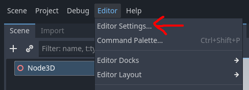
</div>

<div align="center">
  
</div>

You can either paste the path into the text box or click the file icon next to the text field input and navigate to it from there.

### "My imported `.blend` models have no texture!"
This may be because you didn't also import the model's texture files along with the model.  This issue can be fixed by just moving the model's texture files to same relative location it expects them to be.  You do not have to re-import the model.

### "What if I have issues importing `.blend` files due to X?"
If there is an issue importing models using the `.blend` method:
1) Contact Ayden about the issue.  He should be able to assist with the process since he's been able to do this without issue for a couple of test models.  If you cannot get a hold of him, or you need to be able to import models *now*:
2) Export the model to a `glTF 2.0/glb` model.  This is the recommended file format for models you want to import into Godot.  (`.blend` is in second place due to theoretical workflows using older versions of Blender, and/or not all development-group workflows having everyone with Blender installed).  This will lead to duplicate texture files in the project, so keep that in mind if you decide not to fix your issue with `.blend` files not importing.

## 2-3. Configuring the Model Import Settings
Your model is now in Godot!  Before you start using it though, there are some things we recommend you configure before continuing onward.

First, open the model file by double-clicking it in Godot.  This should bring up a pop-up that looks something like this:
<div align="center">
  
</div>

Now click on one of the `MeshInstance3D` nodes in the left panel.
<div align="center">
  
</div>

Go to the right panel, and under `Generate > Occluder`, set the value to `Mesh + Occluder`.  This will make it so the selected mesh won't render when it's not visible.
<div align="center">
  
</div>

Now, we recommend doing this with each `MeshInstance3D` node.  You can't multi-select and change this property on multiple nodes at once, so you have to do it one-by-one.  However, this isn't mandatory (yet) as we don't have any performance concerns at the moment.  However however, we will probably have to do this later down the line at some point, so better to do it now than later.

Once configuration is complete, click the `Reimport` button.  You'll have to repeat this process for any new meshes you add, but it'll only be for the new mesh instance.  If you modify an existing mesh, Godot will automatically recalculate the occlusion mesh.


# 3. Setting up the World.
While you can just add nodes to the scene willy-nilly after copy-pasting an already setup world, you should really learn how to setup one of these worlds from scratch to understand what parts are important.

## 3-1. Adding Collision to the Environment
Please refer to "[Importing Models into Godot](#2-importing-models-into-godot)" for importing the environment model into Godot.  This section is for setting up the collision for an environment.

First, drag the model file from the `FileSystem` tab into the main viewport.  This will place the model into the world.
<div align="center">
  
</div>

Next, click the movie clipboard thing next to the eye to open the model in the editor.  When asked to confirm, click `New Inherited`.  Clicking `Open Anyway` won't let us save any changes we make to the model through Godot.
<div align="center">
  
</div>

A new tab named `[unsaved](*)` should be opened with our model visible.  Any changes made to the model file via Blender or being overwritten will made reflected here.  This is ***NOT*** the scene where we put our player character or NPCs.  This is purely for the model of the world.  Be sure to save this new inherited scene into the `world` folder and name it something relevant.  For these screenshots, it's named `test-environment_model`.
<div align="center">
  
</div>

With our new inherited scene, we can now add collision.  Select the `MeshInstance3D` nodes you want to add collision to.  You can select multiple at once.  You don't have to do all of them at once; you can do chunks at a time.

Once all meshes are selected, navigate to the top toolbar, click the `Mesh` dropdown button with the `MeshInstance3D` icon, then click `Create Collision Shape...`
<div align="center">
  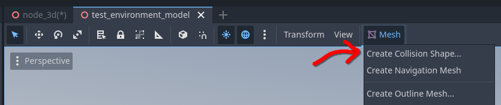
</div>

You'll be presented with two options: one for how to create the collision nodes, and one for how the shape should be generated.  Set `Colllision Shape Placement` to `Static Body Child` and set `Collision Shape Type` to `Trimesh`.  There are hover tooltips for each option that describe what they do.
<div align="center">
  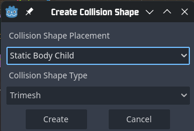
</div>

Now, select each `StaticBody3D` that was generated.  Then, go to the panel on the right and expand the `Collision` section.  Under `Layer`, enable Bit 2/Square 2/Environment and disable the rest of the bits/squares.  This tells Godot that anything that is supposed to collide with the environment is also supposed to collide with this.  Under `Mask`, disable all bits/squares.  This tells Godot that this `StaticBody3D` is not on the lookout for anything that is colliding with it.
<div align="center">
  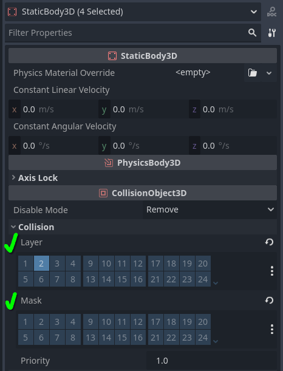
</div>

With collision setup, go back to your main world scene.  Select and delete the model you drag and dropped into the world, as this is not the new inherited scene we just finished creating.
<div align="center">
  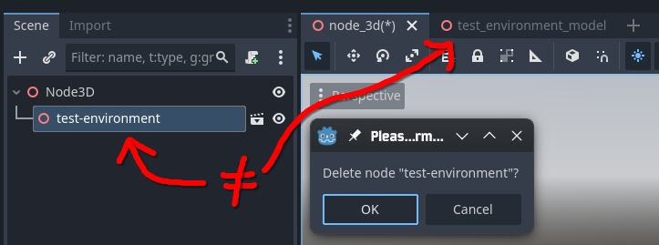
</div>

Now drag and drop the scene we setup the collision in onto the main viewport.  For these screenshots, it's `test-environment_model.tscn`.
<div align="center">
  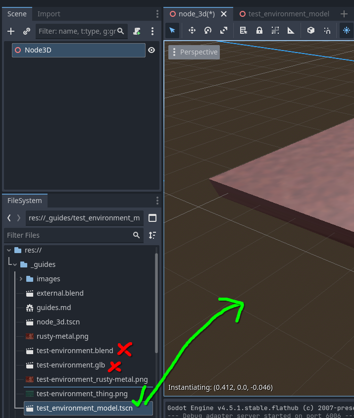
</div>

## 3-2.  Other Visuals
Currently, there is only one other node needed to make the environment not look blank.  The view we get in the main viewport is not the world we see once we hit play.
<div align="center">
  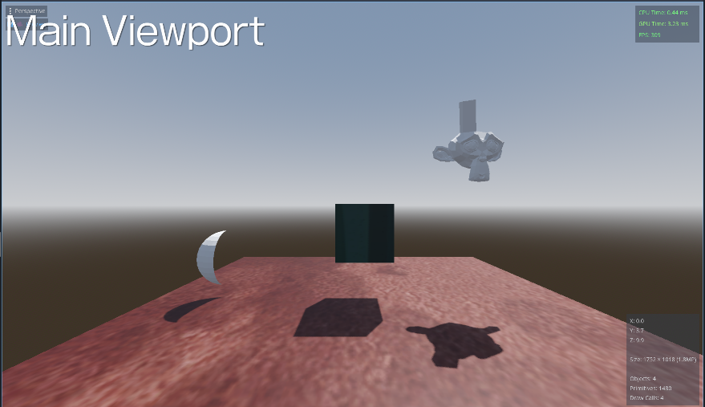
</div>
<div align="center">
  
</div>

To fix this, add a `WorldEnvironment` node.  When you do, the main viewport's background will turn gray like it is in-game.  This doesn't look good though, so load the default environment resource (`default_environment.tres`) into the Environment property of the `WorldEnvironment` node by selecting the `WorldEnvironment` node, locating `default_environment.tres` in the `FileSystem`, and dragging and dropping it.
<div align="center">
  
</div>

The world should look not-gray now.  As of writing, the world should look the same as it did during the Week 6 playtest.  I'm not too sure what each property of the environment resource does, so play around with them!  You can always reset them to their default value by clicking the reset/redo icon next to the property.


## 3-3. Letting the Player Explore this Environment.
To let the player actually explore this environment, there are three scenes you need to add:

1. `player.tscn`:  Located in `entites > player`
2. `player_camera.tscn`:  Located in `entities > player`
3. `input_handler.tscn`:  Located in `helpers`.  You can also add it like any other node.

If there are any unconfigured properties of these nodes that need to be set, a ⚠️ warning sign should appear next to the node.  These will explain what needs to be done to make them go away.  For some warnings, you'll need to save the scene before it detects your changes.  However, some aspects won't warn you when they're not set, whether it be do to an oversight or not *technically* being needed.  For clarity, the proper node setup will be detailed in the [Proper Node Setup](#4-proper-node-setup) section.


# 4. Proper Node Setup
This contains the proper node setup for each node, as well as any other general notes for other built-in Godot nodes.

## StaticBody3D & CollisionShape3D
`StaticBody3D` is the main node type of a non-moving "solid" object and is usually used for the environment.  `CollisionShape3D` is a general-purpose collision node that handles the shape of collision-related nodes.

Scaling a `StaticBody3D` or `CollisionShape3D` un-uniformly (i.e not the same amount for each axis) will cause a ⚠️ warning sign to appear.  This is because scaling either of them this way can make collision go wonky.  Based on sparse testing, scaling the parent node should be fine though.

## Input Handler
This handles all potential inputs a player can make.  It has one required property (`Player`) and two optional lists (`Wants To Know Mouse Moved` and `Wants To Know When Interact`).  `Player` gets set to the player node in the current scene.  Nodes in the two optional lists run a pre-defined function when the aformentioned event in the property name happens.

This *might* be rewritten to be a generic node that gets attached to nodes if time allows for it.

## Player
The main node that gets controlled by the player.  Currently, it needs to be added to the InputHandler's "Wants To Know Mouse Moved" and "Wants To Know When Interact" lists.  The former allows the player to look around, and the latter allows the player to interact with stuff.

## Player Camera
Holds both the player's camera and the HUD node.  It has one required property (`Focus`).  `Focus` gets set to the main object that the player should see a first-person perspective from (e.g  the player character).  Currently, it needs to be added to InputHandler's "Wants To Know When Mouse Moved" list.

Might be switched to a Camera3D node if time allows for us to relook at the camera setup.

## Interactable NPC
TODO:  creeate a script template
https://docs.godotengine.org/en/4.5/tutorials/scripting/creating_script_templates.html
